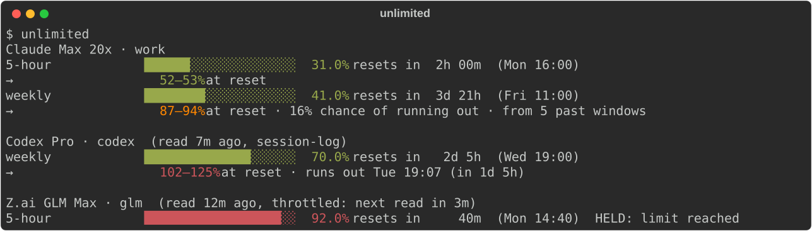

# unlimited

Read AI-subscription quota usage, per window, as facts — and where each window is heading.

```
uv tool install unlimited                # or: pipx install unlimited
```

```
unlimited                                # usage per account, for people
unlimited read [--vendor V]... [--max-age SECONDS] --json
unlimited capture claude-statusline      # in a Claude Code statusline script
```

Each reading gives each limit's window length, the fraction used so far, and its reset time. It
also gives whether the vendor says the limit is held, and why, and, where the vendor names it,
the account's plan and, for Claude, its credits: what it may spend once the windows are used.
unlimited reports what the vendor says, and projects it forward: it never
picks an account or draws a threshold. Choosing what to do with a reading is up to the consumer.

## For people



## For agents

`unlimited read --json` gives the same readings, one per account, for load-balancing and pacing
work across subscriptions (one limit shown):

```json
[
  {
    "schema": 1,
    "vendor": "anthropic",
    "account": "work",
    "taken_at": "2026-09-21T14:00:00+00:00",
    "source": "api",
    "plan": "default_claude_max_20x",
    "status": "ok",
    "why": null,
    "retry_until": null,
    "credits": {
      "taken_at": "2026-09-21T14:00:00+00:00",
      "enabled": true,
      "used": 12.5,
      "limit": 200.0,
      "balance": null,
      "currency": "SGD",
      "severity": "normal",
      "disabled_reason": null,
      "can_purchase": false
    },
    "names": ["work"],
    "limits": [
      {
        "name": "seven_day",
        "window_minutes": 10080,
        "used_at_least": 0.41,
        "resets_at": "2026-09-25T11:00:00+00:00",
        "held": false,
        "held_why": null,
        "severity": null,
        "active": null,
        "kind": null,
        "role": "weekly",
        "scope": null,
        "projection": {
          "at_reset": [0.873, 0.9436],
          "exhausts_at": null,
          "run_out": 0.164,
          "samples": 2,
          "past_windows": 5,
          "since": "2026-09-20T14:00:00+00:00"
        }
      }
    ]
  }
]
```

Read `projection.at_reset` against `used_at_least` rather than either alone, and
`past_windows`/`samples` for how much the projection rests on.

`role` says what kind of window a limit is, whatever the vendor calls it: `session`, `weekly`,
`weekly_model` (one model's weekly limit, named in `scope`), `month`, `extra` (any other window,
named in `scope` where the vendor names it), or `null` for an entry that repeats another or is not
a window. `names` are this machine's names for the account: the config directories or wrappers
holding its credential.

## Credits

A window at 100% is not always the end. Where the vendor reports it (Claude's `spend`), the reading's
`credits` says what the account may spend past its windows, in `currency`'s major units:
`used` of `limit` this period, any prepaid `balance`, and whether spending is `enabled` now, with
the vendor's own `disabled_reason` when it is not (e.g. `org_level_disabled_until`, a cap the
organisation switched off). `limit: null` with `enabled: false` is an account that never turned
credits on. Whether more can be spent is `enabled` and `used < limit`; unlimited draws no line.
`credits.taken_at` is when the vendor said so: a fresh statusline `capture` carries the last
API read's credits forward, dated. `credits` is `null` for vendors without the concept, and is
not projected: the vendor reports no reset for it.

## Sources

| Vendor | Local, no network | Network |
|---|---|---|
| Anthropic (Claude Code, claude.ai sign-in) | the `rate_limits` Claude Code hands its statusline, via `capture` | `oauth/usage` on Claude Code's own token |
| OpenAI (Codex, ChatGPT sign-in) | `rate_limits` in Codex's session logs | `wham/usage` on Codex's own token |
| Z.ai (GLM coding plan) | — | `quota/limit` on each claude-glm wrapper's API key |
| Moonshot Kimi (Kimi Code coding plan) | — | `coding/v1/usages` on each claude-kimi wrapper's API key |
| OpenCode Go | — | `zen/go/v1/usage` on the Go key in each opencode identity's auth.json: the default and every `~/.opencode-N` ([add another](scripts/add-opencode-go-account.sh)) |
| xAI Grok (SuperGrok, Grok CLI sign-in) | — | the Grok CLI's billing proxy on its own token |

The network endpoints are not officially documented and may change without notice. unlimited
reads each harness's credential where the harness keeps it. It never refreshes a token or
writes a credential, and no token appears in its output, cache or errors.

## Projection

Each limit also carries a `projection`: where the window is heading, from the readings unlimited
has taken. Within the window, two paces are extended to the reset — the average since it opened,
and a recency-weighted pace with a half-life of a fourteenth of the window, which rises with a
burst and falls in a quiet spell. Past windows of the same limit, kept for
eight windows, add the shape of use (quiet nights, busy Mondays): each one's use from this point
to its end, shifted to today's. They take over from the paces between the third and eighth window.

`at_reset` is `[low, high]`, unclamped, so `1.07` means use would pass the limit. `exhausts_at`
is when the high end reaches it, if before the reset. `run_out` is how likely use passes it, from the past windows that did, or `null`
without them. `samples`, `past_windows` and `since` say what it rests on. A projection is only as good as how often something reads: a statusline
`capture` feeds it continuously.

## Cache

There is one cache file and one `flock` per vendor under `$XDG_CACHE_HOME/unlimited`, mode
`0600`. Concurrent callers share one upstream request. A 429's `Retry-After` holds off every
caller until it passes, capped at 24 hours; a 429 or 5xx holds off at least five minutes, and the
account's last good reading stands in the meantime. On macOS the keychain is readable only from the
user's GUI session or launchd, not over plain ssh.

## Status

Pre-release. The schema (`"schema": 1`) may still change.

## Releasing

`main` takes changes only through a pull request that passes the tests and the identity check.
Bump `version` in `pyproject.toml` in one, merge it, then tag the merge commit `vX.Y.Z` and push
the tag: the Publish workflow puts it on PyPI by trusted publishing, with no stored token.

## 2mw2lt

unlimited is part of [2mw2lt](https://2mw2lt.com) — *Too Much Work, Too Little Time* — a steering
partner that coordinates work across AI workers and trusted people. 2mw2lt reads its accounts
through unlimited. Its sibling
[work-tempo](https://github.com/endario/work-tempo) tracks source-code momentum across Git workspaces.
